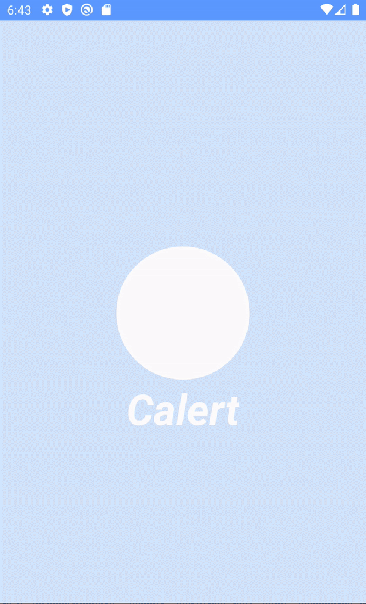
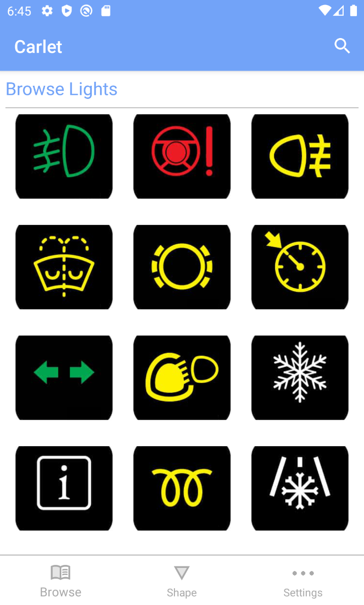
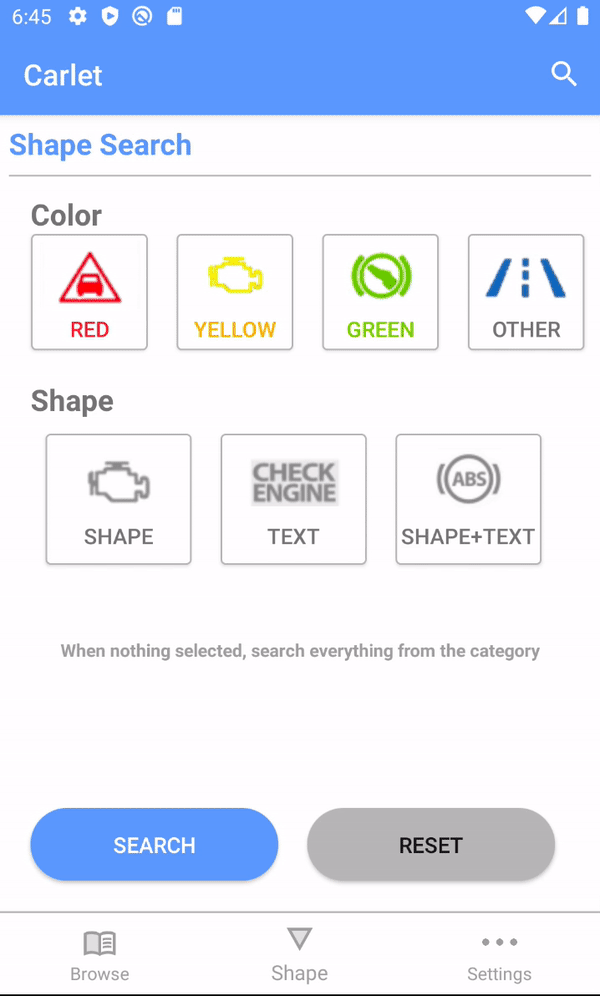
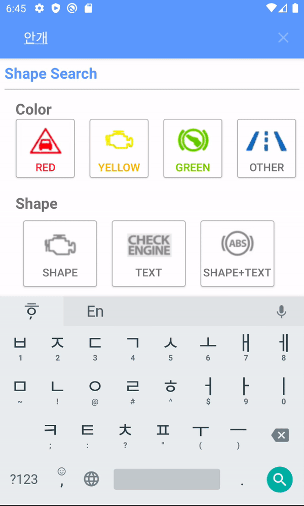

# Calert
Car Dashboard warning symbol finder

</img>
</img>
</img>
</img>
</img>

## Tech Stack
* Android Studio
* Minimum SDK level 21
* JAVA based
* Architecture
  * MVC (Model-View-Controller)

## Library
* [Lottie](https://airbnb.design/lottie/)

## Contributors
  * [@ChoiysApple](https://github.com/ChoiysApple)
  * [@Minji Kang](https://github.com/aldalddl)
  * [@Seyiul](https://github.com/Seyiul)
  * [@rushhour7](https://github.com/rushhour7)
